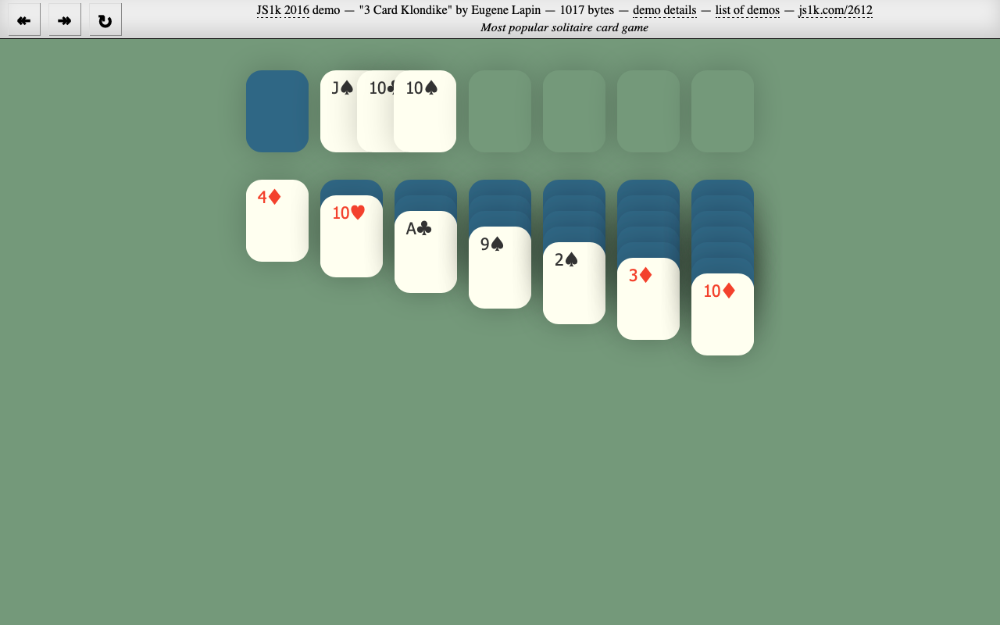

## 3 Card Klondike - 1K JavaScript demo

This is another version of [Kolondike](https://github.com/kolduras/klondike-2015) for [JS1k](http://js1k.com/) code golfing
competition. It has rank #8 in the [compo](https://js1k.com/2016-elemental/).

The demo entry can be seen on the JS1k [website](https://js1k.com/2612) or built from source code.

Build dependencies:
* bash
* Java
* Node.js

### Quick start
```
$ git clone git@github.com:kolduras/klondike-2016.git
$ cd klondike-2016
$ npm install && npm start
```